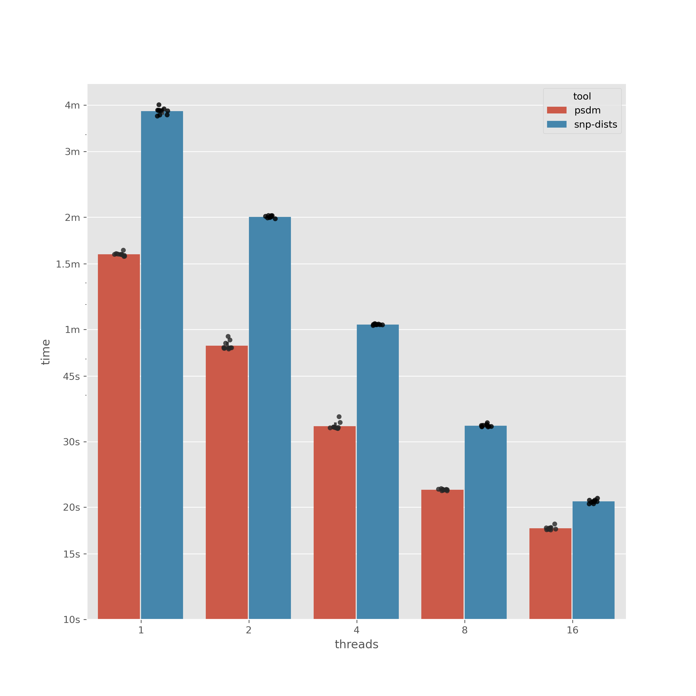

<!--todo-->
[](https://codecov.io/gh/mbhall88/psdm)
[](https://github.com/mbhall88/psdm/actions/workflows/rust-ci.yaml)
[](https://opensource.org/licenses/MIT)
[](https://github.com/mbhall88/psdm/releases)

Compute a pairwise SNP distance matrix from one or two alignment(s)

[TOC]: #

## Table of Contents
- [Motivation](#motivation)
- [Install](#install)
  - [`cargo`](#cargo)
  - [`conda`](#conda)
  - [Precompiled binaries](#precompiled-binaries)
  - [`homebrew`](#homebrew)
  - [Container](#container)
  - [Local](#local)
- [Usage](#usage)
  - [Quick](#quick)
  - [Full](#full)
- [Benchmark](#benchmark)
- [Contributing](#contributing)

## Motivation

A key point of difference for `psdm` is the pairwise SNP distance between **two**
alignment files. This is particularly beneficial if you have computed a SNP distance
matrix for many samples already and want to update the distances with some new samples -
without rerunning the analysis for all samples in the original file.

Another potential use is having two alignment files for the same samples but with
sequences generated by different techniques. For example, if you have produced consensus
sequences from SNP calls from Illumina and Nanopore and want to see how similar the
Illumina-to-Nanopore (inter-technology) distances are - compared to the intra-technology
distances.

Despite these motivations, `psdm` can still be used to compute a "traditional" pairwise
SNP distance matrix for a single FASTA alignment file.

## Install


### `cargo`

[](https://crates.io/crates/psdm)

Prerequisite: [`rust` toolchain][rust] (min. v1.55.0)

```shell
$ cargo install psdm
```

### `conda`

[](https://anaconda.org/bioconda/psdm)
[](https://anaconda.org/bioconda/psdm)

Prerequisite: [`conda`][conda] (and bioconda channel [correctly set up][channels])

```shell
$ conda install psdm
```

### Precompiled binaries

**tl;dr**: Run the following snippet to download the latest binary for your system to
the current directory and show the help menu.

```shell
version="0.1.0"
OS=$(uname -s)                                                                                                       
if [ "$OS" = "Linux" ]; then                                                                                         
    triple="x86_64-unknown-linux-musl"                                                                              
elif [ "$OS" = "Darwin" ]; then                                                                                        
    triple="x86_64-apple-darwin"                                                         
else                                                      
    echo "ERROR: $OS not a recognised operating system"
fi              
if [ -n "$triple" ]; then   
    URL="https://github.com/mbhall88/psdm/releases/download/${version}/psdm-${version}-${triple}.tar.gz"
    wget "$URL" -O - | tar -xzf -
    ./psdm --help             
fi
```

These binaries _do not_ require that you have the `rust` toolchain installed.

Currently, there are two pre-compiled binaries available:
- Linux kernel `x86_64-unknown-linux-musl` (works on most Linux distributions I tested)
- OSX kernel `x86_64-apple-darwin` (works for any post-2007 Mac)

An example of downloading one of these binaries using `wget`

```shell
$ version="0.1.0"
$ URL="https://github.com/mbhall88/psdm/releases/download/${version}/psdm-${version}-x86_64-unknown-linux-musl.tar.gz"
$ wget "$URL" -O - | tar -xzf -
$ ./psdm --help
```

If these binaries do not work on your system please raise an issue and I will
potentially add some additional [target triples][triples].

### `homebrew`

Prerequisite: [`homebrew`][homebrew]

The `homebrew` installation is done via the [homebrew-bio tap][brew-tap].

```shell
$ brew install brewsci/bio/psdm
```

### Container

Docker images are hosted at [quay.io].

#### `singularity`

Prerequisite: [`singularity`][singularity]

```shell
$ URI="docker://quay.io/mbhall88/psdm"
$ singularity exec "$URI" psdm --help
```

The above will use the latest version. If you want to specify a version then use a
[tag][quay.io] (or commit) like so.

```shell
$ VERSION="0.1.0"
$ URI="docker://quay.io/mbhall88/psdm:${VERSION}"
```

#### `docker`

[](https://quay.io/repository/mbhall88/psdm)

Prerequisite: [`docker`][docker]

```shhell
$ docker pull quay.io/mbhall88/psdm
$ docker run quay.io/mbhall88/psdm psdm --help
```

You can find all the available tags on the [quay.io repository][quay.io].

### Local

Prerequisite: [`rust` toolchain][rust]

```sh
$ git clone https://github.com/mbhall88/psdm.git
$ cd psdm
$ cargo build --release
$target/release/psdm --help
# if you want to check everything is working ok
$ cargo test
```

## Usage

### Quick

#### Single alignment file

**`aln1.fa`**

```
>s1
ABCDEFGH
>s2
aBN-XFnH
>s0
AbCdEfG-
```

```shell
$ psdm aln1.fa
,s1,s2,s0
s1,0,3,3
s2,3,0,5
s0,3,5,0
```

#### Two alignment files

**`aln2.fa.gz`**

```
>s2
xXNNfoo=
>s5 description
AB-DEFGG
```

```shell
$ psdm aln1.fa
,s1,s2,s0
s2,6,6,5
s5,1,4,3
```

The column names represent the **first** alignment file provided.

### Full

I'd like the sequences to be sorted by identifier in the output

```shell
$ psdm -s aln1.fa aln2.fa.gz
,s0,s1,s2
s0,0,3,5
s1,3,0,3
s2,5,3,0
```

I want a tab-delimited (TSV) matrix instead of a comma-delimited (CSV) one

```shell
$ psdm -d "\t" aln1.fa
        s1      s2      s0
s1      0       3       3
s2      3       0       5
s0      3       5       0
```

Ignore the case of nucleotides - i.e., `acgt` is the same as `ACGT`

```shell
$ psdm -i aln1.fa
,s1,s2,s0
s1,0,1,0
s2,1,0,1
s0,0,1,0
```

By default, `psdm` ignores `N`'s and gaps (`-`). However, maybe you also want to ignore
`X`'s

```shell
$ psdm -e NX- aln1.fa
,s1,s2,s0
s1,0,2,3
s2,2,0,4
s0,3,4,0
```

Or maybe you don't want to ignore anything

```shell
$ psdm -e "" aln1.fa
,s1,s2,s0
s1,0,5,4
s2,5,0,8
s0,4,8,0
```

I'm impatient, use all the threads I have!

```shell
$ psdm -t 0 aln1.fa
```

Give me long-form output instead of a matrix

```shell
$ psdm -l aln1.fa
s1,s1,0
s1,s2,3
s1,s0,3
s2,s1,3
s2,s2,0
s2,s0,5
s0,s1,3
s0,s2,5
s0,s0,0
```

I'd like to know the progress of the pairwise comparisons

```shell
$ psdm -P big.aln.fa
[2599/11476 (23%) comparisons] █████████░░░░░░░░░░░░░░░░░░░░░░░░░░░░░░░ [ETA 00:00:28]
```

Write the matrix to a file please

```shell
$ psdm -o dists.csv aln1.fa
```

```
$ psdm --help
psdm 0.1.0
Compute a pairwise SNP distance matrix from one or two alignment(s)

USAGE:
    psdm [FLAGS] [OPTIONS] <alignments>...

FLAGS:
    -h, --help
            Prints help information

    -i, --ignore-case
            Ignore case - i.e., dist(a, A) = 0

    -l, --long
            Output as long-form ("melted") table

            By default the output is a N x N or N x M table where N is the number of sequences in the first alignment
            and M is the number of sequences in the (optional) second alignment.
    -q, --quiet
            No logging (except progress info if `-P` is given)

    -P, --progress
            Show a progress bar

    -s, --sort
            Sort the alignment(s) by ID

    -V, --version
            Prints version information


OPTIONS:
    -d, --delim <delimiter>
            Delimiting character for the output table [default: ,]

    -e, --ignored-chars <ignored-chars>
            String of characters to ignore - e.g., `-e N-` -> dist(A, N) = 0 and dist(A, -) = 0

            Note, this option is applied *after* `--ignore-case` - i.e., if using `--ignore-case`, only the uppercase
            form of a character is needed. To not ignore any characters, use `-e ''` or `-e ""` [default: N-]
    -o, --output <output>
            Output file name [default: stdout]

    -t, --threads <threads>
            Number of threads to use. Setting to 0 will use all available [default: 1]


ARGS:
    <alignments>...
            FASTA alignment file(s) to compute the pairwise distance for.

            Providing two files will compute the distances for all sequences in one file against all sequences from the
            other file - i.e., not between sequences in the same file. The first file will be the column names, while
            the second is the row names. The alignment file(s) can be compressed.
```

## Benchmark

We benchmark against [`snp-dists`][snp-dists] (v0.8.2). `snp-dists` is a brilliant tool
for computing SNP distance matrices and is the inspiration for `psdm`.

As `snp-dists` doesn't allow inter-alignment comparisons, we will benchmark the
intra-alignment mode. We use an alignment file of 151 sequences with a length of
4411532bp.

The benchmark times were recorded with [`hyperfine`][hyperfine] with 10 runs for each
tool/threads combination.



| tool      |   threads |   mean |   SD |   min |   median |   max |
|:----------|----------:|-------:|-----:|------:|---------:|------:|
| psdm      |         1 |   95.4 |  1.0 |  94.2 |     95.3 |  97.9 |
| snp-dists |         1 |  231.0 |  4.8 | 224.2 |    231.8 | 240.4 |
| psdm      |         2 |   54.3 |  1.5 |  53.2 |     53.6 |  57.5 |
| snp-dists |         2 |  120.3 |  0.8 | 118.9 |    120.3 | 121.3 |
| psdm      |         4 |   33.0 |  0.8 |  32.5 |     32.7 |  35.0 |
| snp-dists |         4 |   61.8 |  0.2 |  61.5 |     61.8 |  62.2 |
| psdm      |         8 |   22.3 |  0.1 |  22.1 |     22.3 |  22.4 |
| snp-dists |         8 |   33.1 |  0.3 |  32.8 |     33.1 |  33.7 |
| psdm      |        16 |   17.6 |  0.2 |  17.4 |     17.5 |  18.0 |
| snp-dists |        16 |   20.7 |  0.2 |  20.4 |     20.7 |  21.1 |

## Contributing

Contributions are always welcome. For changes to be accepted, they must pass the CI and
coverage checks. These include:

- Code is formatted (`cargo fmt`).
- There are no compiler errors/warnings. `cargo clippy --all-features --all-targets --
  -D warnings`
- Test code coverage has not reduced.

Please also add a succinct description of the contribution in the
[CHANGELOG](CHANGELOG.md).


[rust]: https://www.rust-lang.org/tools/install
[channels]: https://bioconda.github.io/user/install.html#set-up-channels
[conda]: https://docs.conda.io/projects/conda/en/latest/user-guide/install/
[quay.io]: https://quay.io/repository/mbhall88/psdm
[singularity]: https://sylabs.io/guides/3.4/user-guide/quick_start.html#quick-installation-steps
[docker]: https://docs.docker.com/v17.12/install/
[homebrew]: https://docs.brew.sh/Installation
[brew-tap]: https://github.com/brewsci/homebrew-bio
[triples]: https://clang.llvm.org/docs/CrossCompilation.html#target-triple
[snp-dists]: https://github.com/tseemann/snp-dists
[hyperfine]: https://github.com/sharkdp/hyperfine